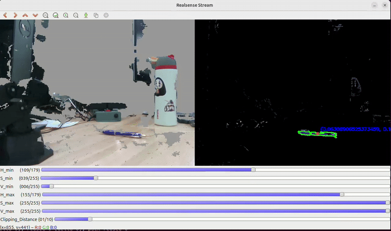
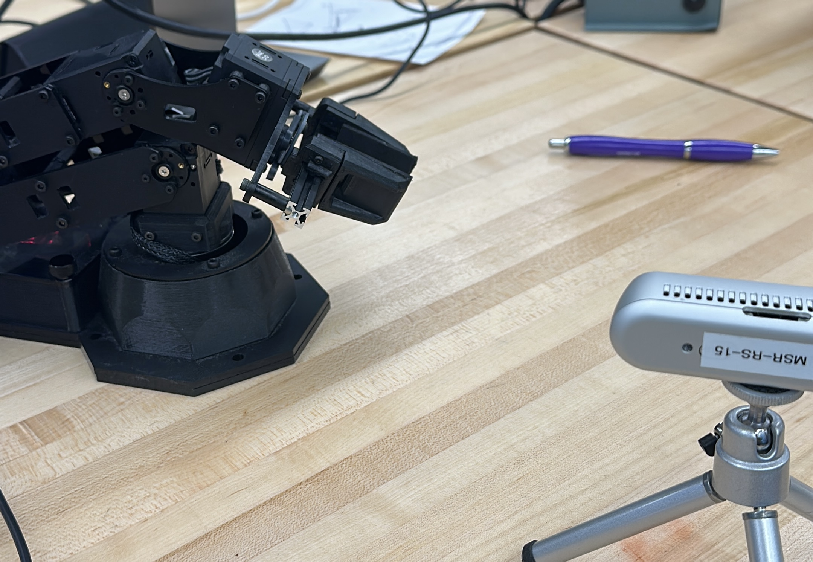

# MSR-PenChallenge
This repository is being used to solve the [Pen Challenge](https://nu-msr.github.io/hackathon/pen_challenge.html) as a part of the MSR Hackathon'25 at Northwestern

### Objective
A PincherX robot arm and a realsense camera are provided. The tasks are as follows:
* Process Video stream from realsense 
* Get 3-D co-ordinates of the center of the pen 
* Get relative position of robot base w.r.t to camera(can be done manually or by calibration)
* Pass the co-ordinates of pen to robot and make it pick the pen.

### Directory Structure
```
MSR-PenChallenge/
├── calibFiles/
│   ├── calib.json  #Stores the calibration values
├── imageProcessor/ 
│   ├── calibration.py #Calculates rotation and translation matrix
│   ├── pipeline.py    # Setup of pipeline from realsense camera
│   ├── streamer.py    # Processes the stream from realsense and output
├── robot/
│   ├── robotControl.py #Controls the interbotix robot arm
├── tools/
│   ├── toolbar.py #OpenCV toolbar
└── videos/
    ├── centroid.gif
    ├── centroid.mp4
├── .gitignore
├── README.md
├── main.py #executes everything

```
### How to run :
* Follow the instructions in the given links to install ROS2, realsense camera libraries and interbotix setup :
   * [ROS2](http://nu-msr.github.io/hackathon/computer_setup.html#robot-operating-system-ros-2--2-P-1)
   * [Realsense Libraries](https://nu-msr.github.io/hackathon/computer_setup.html#realsense)
   * [Interbotix Arms](https://nu-msr.github.io/hackathon/computer_setup.html#interbotix_setup)
     
* Next clone this repository :
   ``` bash
   git clone git@github.com:kjyothiswaroop/MSR-PenChallenge.git
   ```
* Source the terminal if not done already :
  ``` bash
  source ~/ws/interbotix/install/setup.bash
  ```
* Options to run :
   1) Only streaming mode i.e. streaming the realsense feed and visualising the contour:
      ``` bash
      ./main.py --stream=True
      
   2) If you want to record the data you can do :
      ``` bash
      ./main.py --mode="record"
      
   3) If you want to playback the recorded file you can do:
      ``` bash
      ./main.py --mode="playback" --filename="streams/data.bag" [Currently there is no folder called streams but you can create one]
      
   4) For Calibration of the Robot Arm i.e. by calibration we mean finding the Rotation and Translation matrices between Robot base frame and the Realsense camera frame :
      ```bash
      ./main.py --calibrate=True
      ```
      This will basically move the robot to multiple locations with the pen in it and detect the contours and save the data to a JSON file.
      
  5) Finally to run the pen picking demo :
      ```bash
      ./main.py --pickPen=true
    
### Demos :
* Below is the demo of the video stream processing and locating the center of the pen


* Click on the image below to watch the demo on Youtube:
[](https://youtube.com/shorts/IgKwhFp3g9s)

### Author
[Kasina Jyothi Swaroop](https://github.com/kjyothiswaroop)

